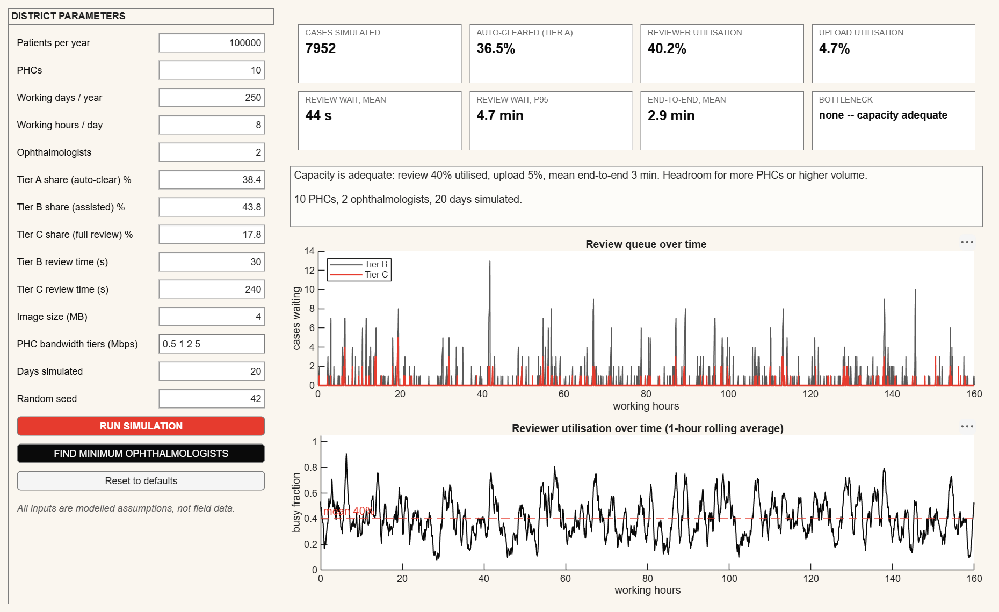

# District Resource Model: standalone app (Simulink Compiler)

> The interactive full-pipeline dashboard has its own standalone app in [`pipeline/`](pipeline/README.md).

The district resource model (PS requirement 5), packaged with **Simulink Compiler** as a Windows app that runs
**without MATLAB or Simulink**. It needs only the free MATLAB Runtime.



*Rendered by the compiled `NetraSetuResourceModel.exe` itself (`--snapshot`), default parameters.*

## What it does

You set a district's parameters:

- patients per year;
- number of PHCs;
- working days and hours;
- number of ophthalmologists;
- the tier mix (A auto-clear / B assisted / C full review);
- review times;
- image size;
- PHC bandwidth tiers;
- days simulated and the random seed.

Then:

- **Run Simulation** shows the KPIs: cases, auto-cleared share, reviewer and upload utilisation, mean and p95
  review wait, and end-to-end time. It also shows the bottleneck, a plain-language recommendation, and the
  review-queue and reviewer-utilisation curves over time.
- **Find Minimum Ophthalmologists** searches for the smallest reviewer pool that keeps the p95 review wait under
  60 minutes, for the routine schedule and for camp mode (the same yearly volume in 50 days).
- **Headless mode** reads parameters from JSON and writes the results to JSON, so a backend job can call it:

  ```
  NetraSetuResourceModel.exe --json params.json results.json
  ```

All inputs are modelled assumptions, not field data, and the app says so on screen.

## Why this is a separate model

Simulink Compiler deploys a model by running it in **Rapid Accelerator**, which generates C code from every block.
**SimEvents blocks do not support code generation.** On 2026-10-03, even a bare Entity Generator failed with
`SimulinkEventEngine:Engine:CodeGenNotSupported`, and MathWorks'
[Simulink Compiler limitations](https://www.mathworks.com/help/slcompiler/ug/rapid-accelerator-dependencies.html)
say the same. So `../districtScreeningSimEvents.slx` can't be deployed.

`districtResourceModel.slx` is the deployable version:

```
Clock (60 s) ─▶ District Screening Engine ─┬─▶ arrived / uploaded / autoCleared
                (MATLAB System block,       ├─▶ queueB / queueC
                 code-generation capable)   ├─▶ reviewersBusy ─▶ ÷ NumOphthalmologists ─▶ reviewerUtil
                                            ├─▶ reviewed
                                            ├─▶ summary (13 values at the horizon)
                                            └─▶ done ─▶ Stop Simulation
```

`DistrictScreeningEngine.m` is `../referenceQueueingModel.m`'s algorithm, rewritten for code generation:

- per-PHC serial upload;
- Tier A auto-clear;
- N reviewers, with Tier C pre-empting Tier B and the pre-empted case resuming its remaining work.

Its random inputs are drawn **in the reference model's exact order**, so for the same parameters and seed it
reproduces the reference model's summary **exactly**, not just within a tolerance. Review-stage events are processed
as simulation time advances. At the horizon the engine drains the queues, emits the summary, and stops the run.

Every parameter is a model-workspace variable, and the model's default parameter behaviour is *Tunable*. The app
changes any parameter through `SimulationInput.setVariable`, without rebuilding the model. Fixed build-time limits:
20 reviewers, 200 PHCs, 500,000 simulated cases.

The SimEvents model stays the PS deliverable and the weekly validation model. This model is what can ship.

## Verification (2026-10-03)

| Check | Result |
|---|---|
| Engine stepped in MATLAB vs `referenceQueueingModel('run')`, 4 scenarios | max relative difference ≤ 1.0e-14 |
| `validateDeployableResourceModel`, **normal** mode, 5 scenarios | 5/5 exact match |
| `validateDeployableResourceModel`, **deployment** mode (`configureForDeployment`, Rapid Accelerator), 5 scenarios | 5/5 exact match. First run ~3 min (code generation); then 4–5 s per scenario with **no rebuild** while changing patients, PHCs, reviewers, tier mix and days |
| Compiled exe, headless, 5 scenarios vs reference | max relative difference ≤ 1.0e-14, same bottleneck in every case |
| Compiled exe, GUI | Opens in ~40 s (Runtime start-up); a default run renders KPIs, recommendation and both charts (screenshot above). No C compiler on PATH at runtime |

The 5 scenarios:

1. Baseline: 10 PHCs, 2 ophthalmologists.
2. Camp mode: 50 days/yr.
3. Small: 3 PHCs, 1 ophthalmologist.
4. Weak model: 30% Tier A, 5 days.
5. Scaled up: 4 ophthalmologists, camp mode.

## Build it

```matlab
cd simulink-model/deployable
buildDeployableResourceModel                         % -> districtResourceModel.slx
validateDeployableResourceModel                      % normal + deployment mode; errors on any mismatch
buildResourceModelApp                                % -> dist/NetraSetuResourceModel.exe
```

You need:

- MATLAB R2026a with Simulink, **Simulink Compiler** and **MATLAB Compiler**;
- a **C compiler selected for MATLAB** (`mex -setup C`). Rapid Accelerator compiles the model to C at build time.

On the build machine there was no MathWorks-installed compiler, so MATLAB was pointed at an existing MSYS2
MinGW-w64 GCC 13.1 for the MATLAB process only:

```
MW_MINGW64_LOC=C:\Users\91740\Desktop\compilerr\ucrt64  matlab -batch "mex -setup C; buildResourceModelApp"
```

That GCC build is not officially supported by MathWorks; it worked for every step above. The supported alternative
is the free "MATLAB Support for MinGW-w64 C/C++ Compiler" add-on.

## Run it on another PC

1. Install the free **MATLAB Runtime R2026a** for Windows from
   <https://www.mathworks.com/products/compiler/matlab-runtime.html>. The app needs the Base, Standard, Extended,
   Graphics and **Simulink Compiler** runtime add-ons (`dist/requiredMCRProducts.txt`); the full installer includes
   them.
2. Copy `NetraSetuResourceModel.exe` and double-click it.

## Files

| File | Role |
|---|---|
| `DistrictScreeningEngine.m` | Code-generation-capable engine (MATLAB System object) |
| `buildDeployableResourceModel.m` | Builds `districtResourceModel.slx` (the script is the source of truth; the `.slx` is a build artifact) |
| `districtResourceModel.slx` | The deployable Simulink model |
| `validateDeployableResourceModel.m` | Exact-match validation against the reference model, normal and deployment mode |
| `DistrictResourceApp.m` | The app: GUI, `--json` headless mode, `--snapshot` (renders its own window to PNG) |
| `buildResourceModelApp.m` | Simulink Compiler / MATLAB Compiler packaging into `dist/` |
| `dist/` | Build output (git-ignored) |
