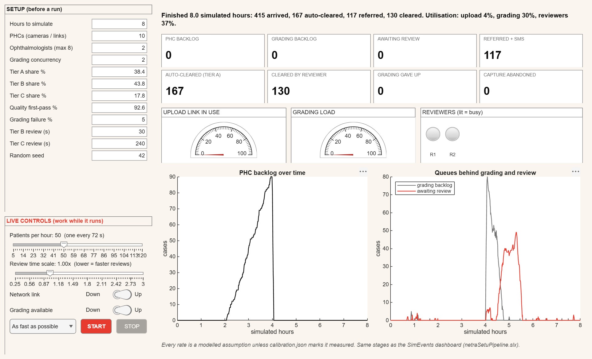

# Live Screening Pipeline Dashboard: standalone app (Simulink Compiler)

The interactive full-pipeline dashboard, packaged with **Simulink Compiler** as a Windows app that runs **without
MATLAB or Simulink**. It needs only the free MATLAB Runtime R2026a.

It is the deployable counterpart of `../../netraSetuPipeline.slx`, the SimEvents dashboard model. That model is
**unchanged** and is still the one to open in Simulink.



*Rendered by the compiled `NetraSetuPipelineDashboard.exe` itself (`--snapshot`): an 8-hour clinic day with the
district link switched off from hour 2 to hour 4. The PHC backlog climbs while the link is down (nothing is lost). It
drains in minutes when the link returns, and that burst moves through grading and then review.*

## What it does

**The pipeline, same stages as the SimEvents model:**

1. Patient arrives.
2. Capture and quality gate (up to 3 retakes; abandoned if still unusable).
3. PHC sync queue.
4. Network upload (one link per PHC).
5. Central grading (capacity 2; fails and retries up to 3 attempts).
6. Tier triage (Tier A auto-clears).
7. Two reviewers (Tier C pre-empts Tier B, which resumes).
8. Referred + SMS, or cleared.

**Live controls.** These work while the simulation runs, as on the Simulink dashboard:

| Control | Effect |
|---|---|
| **Patients per hour** (slider) | Arrival rate |
| **Review time scale** (slider) | 0.5 = each review takes half as long |
| **Network link** (switch) | Down: uploads stop and the PHC backlog grows; nothing is lost |
| **Grading available** (switch) | Down: cases pile up behind grading and the reviewers go idle |
| **Pace** | 100×, 200× (the SimEvents model's default), or as fast as possible (about 200× in the compiled app) |

**Live displays:**

- PHC backlog, grading backlog, awaiting review;
- referred, auto-cleared, cleared by reviewer, grading gave up, capture abandoned;
- upload-link and grading-load gauges;
- a busy lamp per reviewer;
- the PHC backlog, grading backlog and review queue over time.

**Setup** (before a run): hours, PHCs, ophthalmologists (up to 8), grading concurrency, tier mix, quality first-pass
rate, grading failure rate, review times, seed. The defaults come from `../../calibration.json`, the same source the
SimEvents model uses.

**Headless:**

```
NetraSetuPipelineDashboard.exe --json params.json results.json
```

## How the live controls work in a compiled app

Simulink's dashboard sliders and switches only exist inside Simulink, so the app uses Simulink Compiler's mechanism
for interacting with a running simulation instead:

- the four controls are **root inports** of `netraSetuPipelineLive.slx`, fed every step by
  `simulink.compiler.setExternalInputsFcn`;
- the displays read the model's output every step through `setExternalOutputsFcn`;
- `setPostStepFcn` paces the run and keeps the window responsive, so a slider moved mid-run reaches the model within
  the next step.

## Why this is a separate model

SimEvents blocks do not support code generation, and Simulink Compiler can only deploy models that run in Rapid
Accelerator (generated code). See `../README.md`.

`netraSetuPipelineLive.slx` (built by `buildLivePipelineModel.m`) is a clock and four inports driving
`PipelineEngine.m`, a code-generation-capable MATLAB System block:

- every arrival, completion, retry and pre-emption is processed at its exact continuous time;
- the model steps every 5 s, which only sets how often the controls are sampled and the outputs read;
- utilisations are exact time integrals.

**One deliberate behavioural difference.** In the SimEvents model an outage is "the stage takes about 11 days", because
its Entity Gate could not take a switch signal. So the case already in service when the switch flips stays stuck. Here
an outage is what it is in reality: no new upload or grading starts while the switch is off, work in progress
finishes, and the backlog drains when it comes back.

## Verification (2026-10-03)

`validateLivePipelineModel`:

| Check | Result |
|---|---|
| Model vs `PipelineEngine` stepped directly (6 h, same seed) | Exact (difference 0) in normal mode and in Rapid Accelerator deployment mode. 5 s stepping is identical to 1 s stepping |
| Network switched off 2–4 h, **live**, in deployment mode | PHC backlog 0 → peak 96 → 0 by 8 h |
| Grading switched off 2–4 h, live | Grading backlog 0 → 91 → 0; reviewers idle (0.00 busy) during the outage |
| 300 h vs queueing theory | Arrivals, Tier A share, upload / grading / reviewer utilisation and retakes per patient all within 1.2% |
| Compiled exe | Headless matches the deployment-mode run exactly (318 arrived, 85 referred in 6 h); the window opens in ~50 s; the screenshot above was rendered by the exe |

### Comparison with the SimEvents model, and two findings about it

The SimEvents model is deterministic: its random seeds are fixed in the `.slx`, so it is a single sample. Over the
first 12 simulated hours it reports:

- 240 auto-cleared, 203 referred, 211 cleared;
- utilisation 4.6% upload, 31.8% grading, 14.9% reviewers.

This engine, over 40 seeds with the SimEvents model's settings, gives:

- 228 ± 18 auto-cleared, 185 ± 14 referred, 184 ± 11 cleared;
- 4.1% upload, 28.2% grading, 12.7% reviewers.

The engine matches queueing theory; the SimEvents model sits 10–17% above both. Investigating that turned up two
properties of `netraSetuPipeline.slx`. Neither was changed:

1. **It generates more patients than its arrival rate.** It samples inter-arrival times from a random signal refreshed
   once a second (its own build script notes coarser settings "produced noticeably more patients than theory"). Every
   load-driven number inherits the excess.
2. **Its grading-retry loop deadlocks.** A case that fails grading is routed straight back into the same capacity-2
   grading server. If the other slot is busy at that moment, the server is full until the failed case leaves, and the
   failed case can't leave until there is room. In the default 16-hour run, grading stops for good at 13.4 h
   (utilisation frozen at 0.318) and 128 cases are stranded in the grading queue. This engine re-queues a failed case
   at the head of the grading queue instead.

## Build it

```matlab
cd simulink-model/deployable/pipeline
buildLivePipelineModel                 % -> netraSetuPipelineLive.slx
validateLivePipelineModel              % exact, live-control and theory checks; errors on any failure
buildPipelineDashboardApp              % -> dist/NetraSetuPipelineDashboard.exe
```

Requirements are the same as `../README.md`: Simulink Compiler + MATLAB Compiler, and a C compiler selected for MATLAB.
On the build machine that was `MW_MINGW64_LOC=C:\Users\91740\Desktop\compilerr\ucrt64` with `mex -setup C`.
`validateLivePipelineModel` rebuilds the Rapid Accelerator target itself, because deployment mode does not check
whether it is up to date.

## Run it on another PC

1. Install the free **MATLAB Runtime R2026a** for Windows from
   <https://www.mathworks.com/products/compiler/matlab-runtime.html>. The app needs the Simulink Compiler runtime
   add-on (see `dist/requiredMCRProducts.txt`); the full installer includes it.
2. Double-click `NetraSetuPipelineDashboard.exe`. It takes about 50 s to start (Runtime start-up), then press
   **START**.

## Files

| File | Role |
|---|---|
| `PipelineEngine.m` | Code-generation-capable engine (MATLAB System object) |
| `pipelineDefaults.m` | Defaults + `calibration.json` overrides (the same logic as the SimEvents build script) |
| `buildLivePipelineModel.m` | Builds `netraSetuPipelineLive.slx` (the script is the source of truth) |
| `netraSetuPipelineLive.slx` | The deployable Simulink model |
| `validateLivePipelineModel.m` | Exact, live-control and theory validation |
| `PipelineDashboardApp.m` | The app: live GUI, `--json`, `--snapshot` |
| `buildPipelineDashboardApp.m` | Simulink Compiler / MATLAB Compiler packaging into `dist/` |
| `dashboard-screenshot.png` | Rendered by the exe |
| `dist/` | The exe and MATLAB Compiler's build reports |
